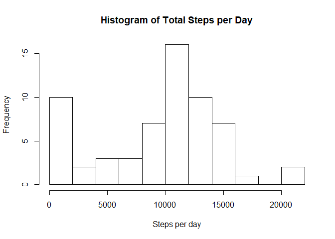
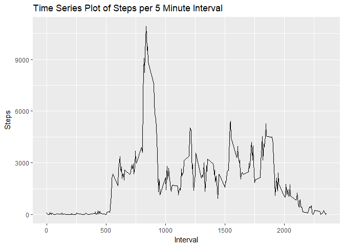
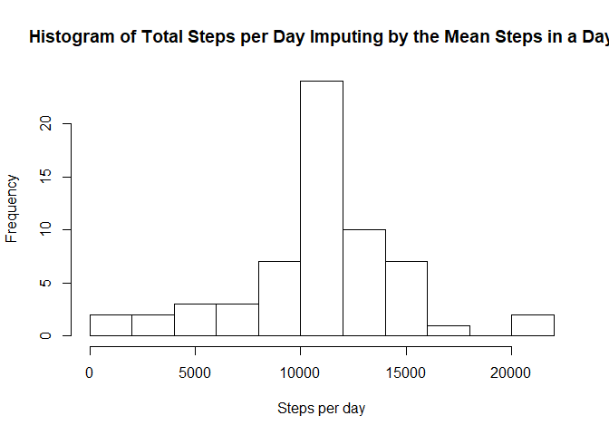
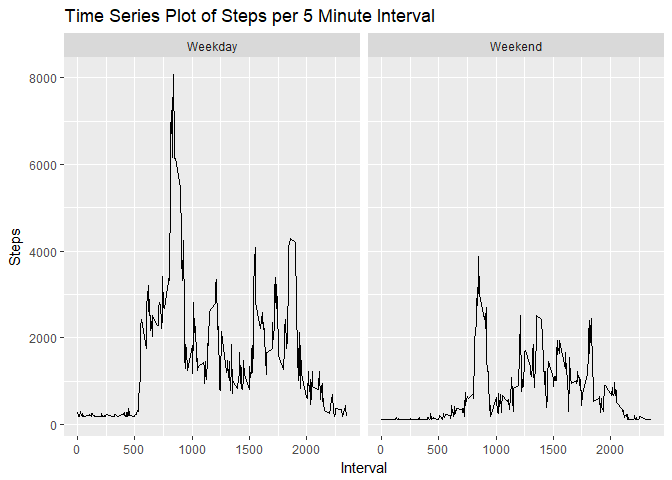

## Loading and preprocessing the data

```r
setwd("C:/Users/luis-alaniz/Desktop/Reproducible Research/Week 2/RepData_PeerAssessment1")
act <- read.csv("activity.csv")
```

## What is mean total number of steps taken per day?

```r
library(dplyr)
```

```
## 
## Attaching package: 'dplyr'
```

```
## The following objects are masked from 'package:stats':
## 
##     filter, lag
```

```
## The following objects are masked from 'package:base':
## 
##     intersect, setdiff, setequal, union
```

```r
library(lubridate)
```

```
## 
## Attaching package: 'lubridate'
```

```
## The following object is masked from 'package:base':
## 
##     date
```

```r
library(ggplot2)
options(scipen = 999)
act <- tbl_df(act)
steps_day <- mutate(act,date = ymd(date)) %>%
        group_by(date) %>%
        summarise(steps = sum(steps, na.rm = TRUE))
with(steps_day,hist(steps, main = "Histogram of Total Steps per Day", xlab = "Steps per day", breaks = 10))
```

<!-- -->

```r
avg <- trunc(mean(steps_day$steps,na.rm = TRUE))
med <- trunc(median(steps_day$steps,na.rm = TRUE))
```
The mean of total steps per day is 9354, and the median is 10395

## What is the average daily activity pattern?

```r
steps_interval <- group_by(act,interval) %>%
        summarise(steps = sum(steps, na.rm = TRUE))
g1 <- ggplot(steps_interval,aes(interval,steps))
g1 + 
        geom_line() + 
        labs(title = "Time Series Plot of Steps per 5 Minute Interval")  +
        labs(x = "Interval") + 
        labs(y = "Steps")
```

<!-- -->

```r
max_int <- steps_interval[which.max(steps_interval$steps),1]
```
The interval that on average across all day contains the maximum number of steps in the dataset is interval number 835.

## Imputing missing values

```r
steps_day_avg <- mutate(act,steps = if_else(is.na(steps), mean(steps, na.rm = TRUE) , as.double(steps))) %>%
        group_by(date) %>%
        summarise(steps = mean(steps))
avg1 <- mean(steps_day_avg$steps)
steps_no_na <- mutate(act, na_num = is.na(steps)) %>%
        mutate(steps = if_else(na_num == TRUE, avg1 , as.double(steps))) %>%
        group_by(date) %>%
        summarise(steps = sum(steps),na_num = sum(as.integer(na_num)))
with(steps_no_na,hist(steps, main = "Histogram of Total Steps per Day Imputing by the Mean Steps in a Day", xlab = "Steps per day", breaks = 10))
```

<!-- -->

```r
na_num <- trunc(sum(steps_no_na$na_num))
avg1 <- trunc(mean(steps_no_na$steps))
med1 <- trunc(median(steps_no_na$steps))
```
The number of missing vaules is 2304. The mean of total steps per day is 10766, and the median is 10766. Both computations differ from the ones witout imputing missing values. The percentage deviation is 15 for the mean, and 3 for the median.

## Are there differences in activity patterns between weekdays and weekends?

```r
library(ggplot2)
week <- mutate(act,steps = if_else(is.na(steps), mean(steps, na.rm = TRUE) , as.double(steps))) %>%
        mutate(day = wday(date)) %>%
        mutate(day_type = as.factor(if_else(day < 6, "Weekday", "Weekend"))) %>%
        group_by(interval,day_type) %>%
        summarise(steps = sum(steps))
g2 <- ggplot(week,aes(interval,steps))
g2 + 
        geom_line() + 
        facet_grid(. ~ day_type) + 
        labs(title = "Time Series Plot of Steps per 5 Minute Interval")  +
        labs(x = "Interval") + 
        labs(y = "Steps")
```

<!-- -->
